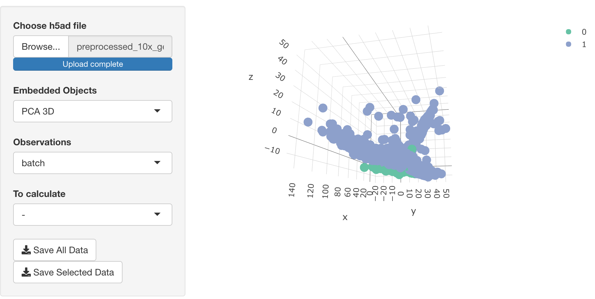

<!-- README.md is generated from README.Rmd. Please edit that file -->

# epishiny 

<!-- badges: start -->

<!-- badges: end -->

This Shiny application is built based on the python package epiScanpy,
which is a tool for single-cell epigenomic analysis (Danese et
al. 2019).

## Installation

The installation consists of 2 parts: R libraries and Python libraries.

### Install R libraries

You can install the released version of epishiny from
[CRAN](https://CRAN.R-project.org) with:

``` r
install.packages("epishiny")
```

Alternatively, you can install the dev version of KRIS from
[Gitlab](https://github.com/kridsadakorn/epishiny) with

``` r
install.packages("remotes")
remotes::install_github("kridsadakorn/epishiny", dependencies = TRUE)
```

### Install Python libraries

Without the virtual library, you can install EpiScanpy using pip:

``` bash
pip install episcanpy
```

If you consider to use conda, virtualenv or any other virtual
environmet, you must set RETICULATE\_PYTHON to the proper path of
python, by running

``` r
Sys.setenv(RETICULATE_PYTHON = "/path/to/python")
```

If you want RETICULATE\_PYTHON to be set every time when the application
starts, you can set RETICULATE\_PYTHON in .Rprofile in your home
directory.

## Document

You can see the reference manual from:
<https://www.biostatgen.org/epishiny/>

## Run the application

You can start the application by calling the function `epishiny()`.

Then, the shiny application will be launched:



## About

  - Maria Colomé-Tatché, visit
    <a href="https://www.professoren.tum.de/en/tum-junior-fellows/c/maria-colome-tatche" border=0 style="border:0; text-decoration:none; outline:none"></a>
    and
    <a href="https://www.helmholtz-muenchen.de/icb/institute/staff/staff/ma/4876/index.html" border=0 style="border:0; text-decoration:none; outline:none"></a><br />
  - Kridsadakorn Chaichoompu, visit
    <a href="https://www.biostatgen.org/" border=0 style="border:0; text-decoration:none; outline:none"></a><br />
